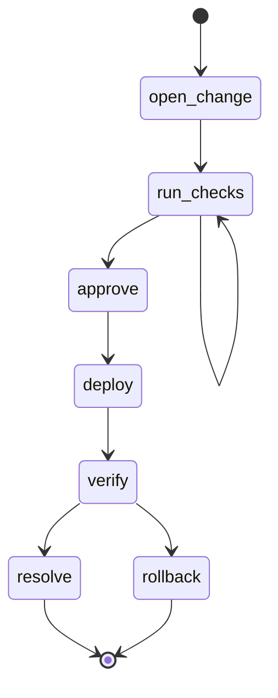
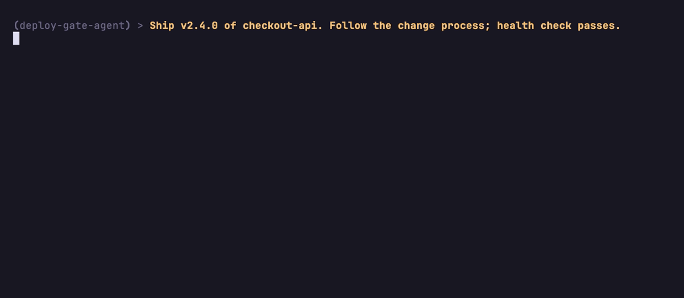
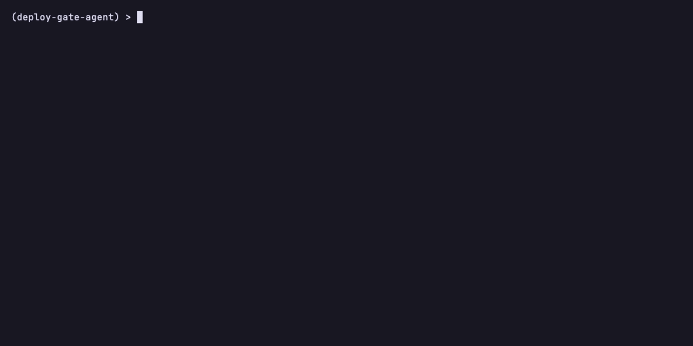

# deploy-gate-agent

A change/deploy-gate agent built with
[BurrMCP](https://github.com/msradam/burrmcp): a deployment workflow defined as
a [Burr](https://burr.dagworks.io/) state machine and served as an
[MCP](https://modelcontextprotocol.io/) server. An LLM walks the change one
enforced transition at a time, and every step is recorded to an audit trail.



This diagram is the contract, and this is the serious end of the spectrum: a
workflow where order matters and a mistake is expensive. Two kinds of gate are
enforced for you:

- **Structural gates** (the graph). There is no path that lets the agent
  `deploy` before `approve`, or `approve` before `run_checks`. An out-of-order
  call returns `invalid_transition` with the reachable actions.
- **A body-level gate.** `resolve` refuses if the post-deploy health check did
  not pass, so closing out green only happens on a healthy deploy. The unhealthy
  path is `rollback`.

The runbook is the graph, and the server holds the line, rather than the model
being asked to remember it.

An LLM drives the whole change over MCP. Here fast-agent connects a
Llama-3.3-70B model (on Together) and the model walks open, checks, approve,
deploy, verify, resolve, one enforced step at a time:



The same workflow is observable from the terminal. `deploy-gate-agent render`
prints the graph; `deploy-gate-agent sessions show` replays a recorded change,
with the refused `resolve` in red:



## Using another MCP server

`run_checks` confirms the change is documented by reading `CHANGELOG.md` from a
separate filesystem MCP server. The action body calls it through BurrMCP's
`call_upstream`, wired in `cli.py`:

```python
cli = build_cli(
    "deploy-gate-agent",
    application=build_application,
    upstream={"fs": {"command": "npx", "args": ["-y", "@modelcontextprotocol/server-filesystem", "."]}},
)
```

```python
changelog = await call_upstream("fs", "read_file", {"path": "CHANGELOG.md"})
```

The agent connects to one server (this one) and sees one tool, `step`. The
filesystem server is reached from inside the action, so the call advances state
like any other step. This path needs Node and `npx` available for the filesystem
server.

## Install

```bash
git clone https://github.com/msradam/deploy-gate-agent.git
cd deploy-gate-agent
uv venv --python 3.13
uv pip install -e .
```

## Run it as an agent

The repo ships an `.mcp.json` pointing a client at `deploy-gate-agent serve`.

### Claude Code

```bash
claude mcp add --transport stdio deploy-gate-agent -- uv run deploy-gate-agent serve
claude
```

Then: "Ship version v2.4.0 of checkout-api. Follow the change process." The
agent opens the change, runs checks, gets approval, deploys, verifies, and
resolves or rolls back. Try telling it to deploy immediately and watch the
server refuse.

### fast-agent (terminal REPL)

The repo ships a `fastagent.config.yaml` defining this server, so:

```bash
uvx fast-agent-mcp go --servers deploy-gate-agent -m "Ship v2.4.0 of checkout-api. Follow the change process; health check passes."
```

It uses Gemini by default (set `GOOGLE_API_KEY`). To drive it with a Together
model instead, set `GENERIC_API_KEY` and add
`--model generic.meta-llama/Llama-3.3-70B-Instruct-Turbo`.

### MCPJam (one npx command, browser playground, free models)

```bash
npx @mcpjam/inspector
```

Add the server with command `uv`, args `run deploy-gate-agent serve`.

## The audit trail

Every change is a recorded session: who approved, what was deployed, whether it
verified, and how it ended.

```bash
uv run deploy-gate-agent sessions show   # full timeline, refusals in red
uv run deploy-gate-agent watch           # live-tail an in-flight change
uv run deploy-gate-agent ui              # open Burr's web UI to replay it
```

## License

Apache 2.0. Built on [BurrMCP](https://github.com/msradam/burrmcp),
[Apache Burr](https://github.com/apache/burr), and
[FastMCP](https://github.com/jlowin/fastmcp).
